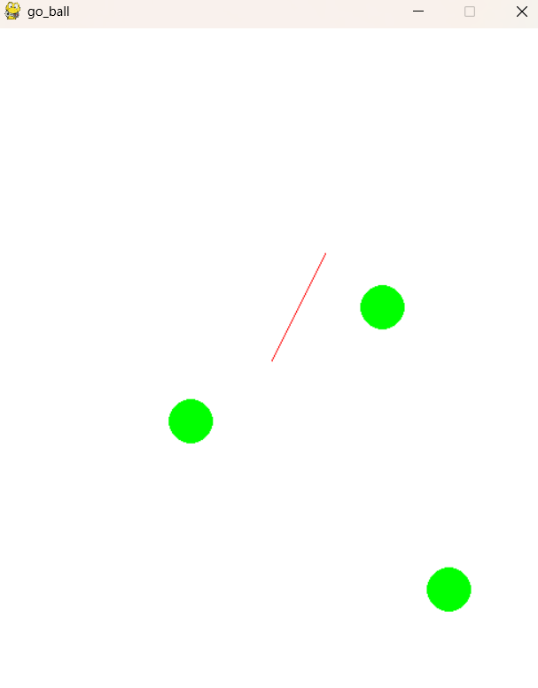

# GoBall

Это простая программа для симуляции отскока шаров на **PyGame**. В ней вы можете запускать одинаковые шары в разные стороны и с разной скоростью, а также перемещать само место запуска (ПКМ).

Интерфейс:



## Запуск проекта

### Что нужно для запуска?

- [Git](https://git-scm.com/downloads)
- [Python3.11+](https://www.python.org/downloads/)

### Запуск:
1. Клонирование репозитория и переход в директорию проекта:
   ```bash
   git clone https://github.com/Shashaev/GoBall.git
   cd GoBall
   ```
2. Создание и активация виртуального окружения:
  - **Windows**
    ```bash
    python -m venv venv
    venv\Scripts\activate
    ```
  - **Linux/macOS**
    ```bash
    python3 -m venv venv
    source venv/bin/activate
    ```
3. Устоновка записимостей:
    ```bash
    pip install -r requirements/prod.txt
    ```
4. Запуск проекта:
  - **Windows**
    ```bash
    python src/main.py
    ```
  - **Linux/macOS**
    ```bash
    python3 src/main.py
    ```

После запуска откроется экран с графическим интерфейсом.